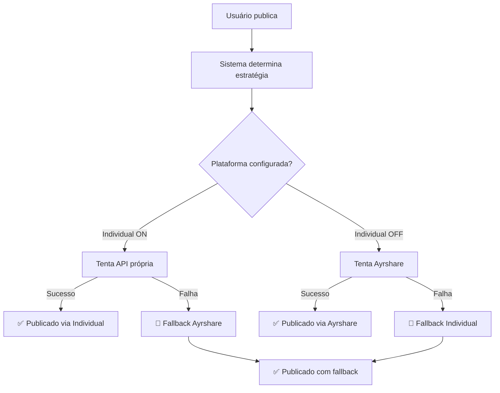

# 🚀 Social Media Manager Pro - Sistema Híbrido Completo

Sistema **REVOLUCIONÁRIO** de gerenciamento de redes sociais com **publicação híbrida inteligente** para **TODAS as plataformas**, **analytics em tempo real** e **agendamento automático**.

## ✨ Sistema Híbrido Inteligente

### Cria um servidor de link para o localhost:3001
	cloudflared tunnel --url http://localhost:3001

### 🎯 Como Funciona
Para **CADA plataforma**, você pode escolher:
- **📡 Via Ayrshare** (Simples - uma API para todas)
- **🔗 Via API Própria** (Avançado - controle total)
- **🛡️ Redundância Automática** - Se uma API falha, usa a outra

### 📱 Plataformas Suportadas
| Plataforma | Ayrshare | API Própria | Recursos Extras |
|------------|----------|-------------|----------------|
| **Instagram** | ✅ | ✅ Meta Graph API | Stories, Reels |
| **Facebook** | ✅ | ✅ Graph API | Pages, Groups |
| **Twitter** | ✅ | ✅ API v2 | Threads, Spaces |
| **YouTube** | ✅ | ✅ Data API v3 | Vídeos, Community |
| **LinkedIn** | ✅ | ✅ API v2 | Company Pages |
| **TikTok** | ✅ | ✅ Business API | Vídeos nativos |
| **Snapchat** | ✅ | ✅ Kit API | Stories, Ads |
| **Pinterest** | ✅ | ✅ API v5 | Pins, Boards |

## 🔧 Configuração Híbrida

### 1. Configuração Básica (Ayrshare)
```env
# Funciona para TODAS as plataformas
AYRSHARE_API_KEY=sua_api_key_do_ayrshare
```

### 2. Configuração Avançada (APIs Individuais)
```env
# Instagram
INSTAGRAM_ACCESS_TOKEN=EAAJ...
INSTAGRAM_USER_ID=123456789

# Facebook  
FACEBOOK_ACCESS_TOKEN=EAAPGto...
FACEBOOK_PAGE_ID=987654321

# Twitter
TWITTER_API_KEY=sua_api_key
TWITTER_API_SECRET=seu_api_secret
TWITTER_ACCESS_TOKEN=seu_access_token
TWITTER_ACCESS_SECRET=seu_access_secret

# YouTube
YOUTUBE_CLIENT_ID=689417920589-xxx.apps.googleusercontent.com
YOUTUBE_CLIENT_SECRET=GOCSPX-xxx

# LinkedIn
LINKEDIN_ACCESS_TOKEN=seu_linkedin_token

# TikTok
TIKTOK_ACCESS_TOKEN=seu_tiktok_token

# Snapchat
SNAPCHAT_ACCESS_TOKEN=seu_snapchat_token

# Pinterest
PINTEREST_ACCESS_TOKEN=seu_pinterest_token
```

## 🎛️ Interface de Controle

### Via Interface Web
1. Acesse `http://localhost:3001/config.html`
2. Para cada plataforma, escolha:
   - **Toggle OFF** = Via Ayrshare (padrão)
   - **Toggle ON** = Via API própria
3. Configure credenciais específicas
4. Teste cada API individualmente

### Via Código
```javascript
// Testar estratégia híbrida
testHybridStrategy()

// Ver preferências atuais
collectUserPreferences()

// Simular publicação
simulateHybridPublishing()
```

## 🚀 Estratégias de Publicação

### 🎯 Estratégia 1: "Ayrshare First"
```
Instagram: Ayrshare → Individual (fallback)
Facebook: Ayrshare → Individual (fallback)
Twitter: Ayrshare → Individual (fallback)
```
**Vantagem**: Simplicidade máxima

### ⚡ Estratégia 2: "Individual First"  
```
Instagram: Individual → Ayrshare (fallback)
Facebook: Individual → Ayrshare (fallback)
YouTube: Individual → Ayrshare (fallback)
```
**Vantagem**: Controle e recursos avançados

### 🛡️ Estratégia 3: "Híbrida Inteligente"
```
Instagram: Individual (configurado) → Ayrshare
Facebook: Ayrshare → Individual
YouTube: Individual → Ayrshare
TikTok: Ayrshare (única opção)
```
**Vantagem**: Melhor dos dois mundos

## 📊 Analytics em Tempo Real

### Dados Reais Integrados
- **Ayrshare Analytics** - Quando configurado
- **APIs Individuais** - Métricas nativas
- **Combinação Inteligente** - Melhor visão geral

### Filtros Avançados
```javascript
GET /api/analytics?timeRange=30&platform=instagram&metricType=engagement

// Retorna dados filtrados específicos da plataforma
```

## 🔄 Fluxo de Publicação



## 🧪 Testes e Validação

### Testar Estratégia Completa
```bash
# No console do navegador
testHybridStrategy()

# Resultado exemplo:
🎯 Estratégia: 3 via Ayrshare, 2 via APIs individuais
⚠️ 1 plataforma não configurada
```

### Testar APIs Individuais
```bash
# Para cada plataforma
testPlatformAPI('instagram')
testPlatformAPI('youtube')
testPlatformAPI('twitter')
```

### Simular Publicação
```bash
simulateHybridPublishing()

# Mostra exatamente como cada plataforma seria publicada
```

## 🎛️ Vantagens do Sistema Híbrido

### ✅ **Redundância Total**
- Se Ayrshare cai, APIs individuais continuam
- Se uma API individual falha, Ayrshare assume
- **Zero downtime** de publicação

### ⚡ **Performance Otimizada**
- APIs diretas podem ser mais rápidas
- Menos intermediários = menos latência
- Upload direto de mídia

### 🎯 **Recursos Avançados**
- **YouTube**: Upload de vídeos nativos
- **Instagram**: Stories e Reels
- **Twitter**: Threads e polls
- **LinkedIn**: Posts em company pages

### 📊 **Analytics Detalhados**
- Métricas nativas de cada plataforma
- Dados mais precisos e em tempo real
- Combinação inteligente de fontes

## 🔧 Configuração em Produção

### Docker Compose
```yaml
version: '3.8'
services:
  social-media-manager:
    build: .
    ports:
      - "3001:3001"
    environment:
      - NODE_ENV=production
      - AYRSHARE_API_KEY=${AYRSHARE_API_KEY}
      - INSTAGRAM_ACCESS_TOKEN=${INSTAGRAM_ACCESS_TOKEN}
      # ... outras variáveis
    volumes:
      - uploads:/app/uploads
    restart: always
```

### PM2 Ecosystem
```javascript
module.exports = {
  apps: [{
    name: 'social-media-manager-hybrid',
    script: 'server.js',
    instances: 'max',
    exec_mode: 'cluster',
    env: {
      NODE_ENV: 'development'
    },
    env_production: {
      NODE_ENV: 'production',
      PORT: 3001
    }
  }]
}
```

## 📈 Monitoramento

### Logs Estruturados
```bash
# Ver estratégias em tempo real
pm2 logs --lines 100 | grep "🎯 Estratégia"

# Ver fallbacks ativados  
pm2 logs --lines 100 | grep "🔄 Fallback"

# Ver sucessos por método
pm2 logs --lines 100 | grep "✅"
```

### Métricas do Sistema
```javascript
GET /api/status

{
  "hybridSystem": {
    "enabled": true,
    "ayrshare": true,
    "individualAPIs": {
      "instagram": true,
      "youtube": true,
      "twitter": false
    }
  }
}
```

## 🚀 Implantação

### Desenvolvimento
```bash
git clone <repo>
cd social-media-manager-pro
npm install
cp .env.example .env
# Configure suas APIs
npm run dev
```

### Produção
```bash
npm run build
pm2 start ecosystem.config.js --env production
pm2 save
pm2 startup
```

## 🎉 Resultado Final

**Sistema HÍBRIDO INTELIGENTE** que:
- ✅ **Funciona com qualquer combinação** de APIs
- ✅ **Nunca falha completamente** (redundância)
- ✅ **Otimiza automaticamente** a estratégia
- ✅ **Scales para qualquer volume** de publicação
- ✅ **Analytics unificados** de múltiplas fontes
- ✅ **Interface única** para todas as redes

**🎯 O futuro do gerenciamento de redes sociais está aqui!**

## 🔧 Instalação e Configuração

### 1. Pré-requisitos
```bash
# Node.js 16+ e npm
node --version
npm --version
```

### 2. Clone e Instalação
```bash
git clone <repository-url>
cd social-media-manager-pro
npm install
```

### 3. Configuração do .env
Copie o arquivo `.env` incluído e configure suas credenciais:

```env
# =================================
# AYRSHARE API (PRINCIPAL - OBRIGATÓRIO)
# =================================
AYRSHARE_API_KEY=sua_api_key_aqui

# =================================
# CLOUDINARY (UPLOAD DE MÍDIA - OBRIGATÓRIO)
# =================================
CLOUDINARY_CLOUD_NAME=seu_cloud_name
CLOUDINARY_API_KEY=sua_api_key
CLOUDINARY_API_SECRET=seu_api_secret

# =================================
# YOUTUBE API (Opcional - para API própria)
# =================================
YOUTUBE_CLIENT_ID=seu_client_id.apps.googleusercontent.com
YOUTUBE_CLIENT_SECRET=GOCSPX-seu_client_secret
```

### 4. Iniciar o Servidor
```bash
# Desenvolvimento
npm run dev

# Produção
npm start
```

## 🔑 Obtendo as Credenciais

### Ayrshare (Obrigatório)
1. Acesse [ayrshare.com](https://www.ayrshare.com/)
2. Crie uma conta
3. Vá em **Dashboard → API Key**
4. Copie sua API Key
5. Conecte suas redes sociais no painel do Ayrshare

### Cloudinary (Obrigatório para mídia)
1. Acesse [cloudinary.com](https://cloudinary.com/)
2. Crie uma conta gratuita
3. Vá em **Dashboard**
4. Copie: Cloud Name, API Key, API Secret

### YouTube (Opcional - para API própria)
1. Acesse [Google Cloud Console](https://console.developers.google.com/)
2. Crie um novo projeto
3. Ative a **YouTube Data API v3**
4. Crie credenciais **OAuth 2.0**
5. Configure redirect URIs para seu domínio

### Instagram/Facebook (Opcional)
1. Acesse [Facebook Developers](https://developers.facebook.com/)
2. Crie um app
3. Configure Instagram Basic Display API
4. Gere tokens de acesso

## 🚀 Como Usar

### 1. Configuração Inicial
1. Acesse `http://localhost:3001/config.html`
2. Configure sua **API Key do Ayrshare**
3. Configure **Cloudinary** para upload de mídia
4. Teste as conexões com os botões de teste
5. Configure APIs individuais se desejar (YouTube, etc.)

### 2. Publicação
1. Acesse `http://localhost:3001`
2. Digite seu conteúdo
3. Adicione hashtags
4. Selecione plataformas
5. Faça upload de mídia (opcional)
6. Clique em **Publicar Agora**

### 3. Agendamento
1. Acesse `http://localhost:3001/calendar.html`
2. Clique em **Agendar Post** ou em uma data
3. Preencha os dados
4. Defina data/hora
5. O sistema publicará automaticamente

### 4. Analytics
1. Acesse `http://localhost:3001/analytics.html`
2. Use os filtros para personalizar visualização
3. Acompanhe métricas em tempo real
4. Visualize posts recentes e performance

## 🎯 Sistema Híbrido Explicado

### Como Funciona
O sistema usa uma **estratégia inteligente** para publicação:

1. **Ayrshare Primeiro** - Tenta publicar via Ayrshare
2. **Fallback Individual** - Se falhar, usa APIs individuais
3. **YouTube Especial** - Duas opções:
   - Via Ayrshare (padrão)
   - Via API própria do Google (para recursos avançados)

### Vantagens
- ✅ **Redundância** - Se uma API falha, usa outra
- ✅ **Flexibilidade** - Diferentes estratégias por plataforma
- ✅ **Simplicidade** - Interface única para todas as redes
- ✅ **Escalabilidade** - Fácil adicionar novas plataformas

## 📊 Analytics Detalhados

### Fontes de Dados
1. **Ayrshare** - Dados reais quando configurado
2. **Posts Locais** - Combinado com simulação inteligente
3. **Cache Inteligente** - 5 minutos para performance

### Filtros Disponíveis
- **Período**: 7, 30, 90 dias ou 1 ano
- **Plataforma**: Todas ou específica
- **Métrica**: Engajamento, Alcance, Impressões, Cliques

### Métricas Incluídas
- 📈 **Alcance Total**
- ❤️ **Engajamento**
- 🔄 **Compartilhamentos**
- 👆 **Cliques**
- 📱 **Por Plataforma**
- 📅 **Timeline**

## 🔒 Segurança e Produção

### Variáveis de Ambiente
```env
NODE_ENV=production
PORT=3001

# Configurações de segurança
CORS_ORIGIN=https://seudominio.com
JWT_SECRET=seu_jwt_secret_aqui
```

### Deploy
```bash
# Build para produção
npm run build

# Iniciar com PM2 (recomendado)
npm install -g pm2
pm2 start server.js --name "social-media-manager"
pm2 startup
pm2 save
```

### Nginx (Proxy Reverso)
```nginx
server {
    listen 80;
    server_name seudominio.com;
    
    location / {
        proxy_pass http://localhost:3001;
        proxy_http_version 1.1;
        proxy_set_header Upgrade $http_upgrade;
        proxy_set_header Connection 'upgrade';
        proxy_set_header Host $host;
        proxy_set_header X-Real-IP $remote_addr;
        proxy_set_header X-Forwarded-For $proxy_add_x_forwarded_for;
        proxy_set_header X-Forwarded-Proto $scheme;
        proxy_cache_bypass $http_upgrade;
    }
}
```

## 🛠️ API Endpoints

### Publicação
```javascript
POST /api/publish
Content-Type: multipart/form-data

{
    "content": "Texto do post",
    "hashtags": "#marketing #social",
    "platforms": ["instagram", "facebook"],
    "files": [arquivo1, arquivo2]
}
```

### Analytics
```javascript
GET /api/analytics?timeRange=30&platform=all&metricType=engagement

Response:
{
    "success": true,
    "data": {
        "metrics": {...},
        "timeline": [...],
        "platforms": {...},
        "recentPosts": [...]
    }
}
```

### Agendamento
```javascript
POST /api/schedule
{
    "content": "Post agendado",
    "scheduledDate": "2025-06-20",
    "scheduledTime": "14:30",
    "platforms": ["instagram"]
}
```

### Status
```javascript
GET /api/status
GET /health
```

## 🧪 Testes e Debug

### Comandos de Teste
No console do navegador (F12):

```javascript
// Testar Ayrshare
testAyrshareConnection()

// Testar YouTube
testYouTubeOnly()

// Ver status
showConfigStatus()

// Debug analytics
debugAnalytics()

// Testar filtros
testFilters()
```

### Logs do Servidor
```bash
# Ver logs em tempo real
pm2 logs social-media-manager

# Monitorar status
pm2 status
```

## 🐛 Solução de Problemas

### Erro: "Ayrshare API Key inválida"
1. Verifique se a API Key está correta no `.env`
2. Teste a conexão em Configurações
3. Verifique se a conta Ayrshare está ativa

### Erro: "Cloudinary upload failed"
1. Verifique credenciais no `.env`
2. Teste upload em Configurações
3. Verifique limites da conta Cloudinary

### Erro: "Platform not configured"
1. Vá em Configurações
2. Configure a plataforma específica
3. Teste a API individual

### Posts não aparecem no Analytics
1. Aguarde até 5 minutos (cache)
2. Force atualização clicando "Atualizar"
3. Verifique se Ayrshare está retornando dados

## 🔄 Atualizações e Manutenção

### Backup Regular
```bash
# Exportar configurações (no navegador)
exportConfig()

# Backup do servidor
tar -czf backup-$(date +%Y%m%d).tar.gz .env uploads/ node_modules/
```

### Monitoramento
```bash
# Status do sistema
curl http://localhost:3001/health

# Logs de erro
grep ERROR logs/app.log

# Uso de recursos
pm2 monit
```

### Limpeza
```bash
# Limpar uploads antigos (automático às 2h)
# Limpar cache de analytics (automático a cada hora)

# Manual
rm -rf uploads/*
```

## 📈 Melhorias Futuras

### Roadmap
- [ ] **Dashboard Avançado** - Mais gráficos e insights
- [ ] **Automação IA** - Sugestões de conteúdo
- [ ] **Multi-usuários** - Sistema de equipes
- [ ] **Webhook** - Integração com outros sistemas
- [ ] **Mobile App** - Aplicativo nativo
- [ ] **Stories** - Suporte para Instagram/Facebook Stories

### Contribuição
1. Fork o projeto
2. Crie uma branch (`git checkout -b feature/nova-funcionalidade`)
3. Commit suas mudanças (`git commit -am 'Adiciona nova funcionalidade'`)
4. Push para a branch (`git push origin feature/nova-funcionalidade`)
5. Crie um Pull Request

## 📞 Suporte

### Documentação Adicional
- [Ayrshare API Docs](https://docs.ayrshare.com/)
- [Cloudinary Docs](https://cloudinary.com/documentation)
- [YouTube API Docs](https://developers.google.com/youtube/v3)

### Contato
- **Issues**: Use o GitHub Issues
- **Discussões**: GitHub Discussions
- **Email**: suporte@seudominio.com

## 📜 Licença

MIT License - veja o arquivo [LICENSE](LICENSE) para detalhes.

## 🎉 Agradecimentos

- **Ayrshare** - Pela excelente API de redes sociais
- **Cloudinary** - Pelo serviço de upload de mídia
- **Chart.js** - Pelos gráficos interativos
- **Font Awesome** - Pelos ícones

---

## 📋 Checklist de Produção

### ✅ Antes do Deploy
- [ ] Configurar todas as variáveis de ambiente
- [ ] Testar todas as APIs
- [ ] Configurar Nginx/Apache
- [ ] Configurar SSL/HTTPS
- [ ] Testar backup/restore
- [ ] Configurar monitoramento

### ✅ Pós Deploy
- [ ] Verificar logs de erro
- [ ] Testar publicação em produção
- [ ] Verificar analytics
- [ ] Testar agendamento
- [ ] Configurar alertas
- [ ] Documentar URLs de produção

### ✅ Manutenção Semanal
- [ ] Verificar logs de erro
- [ ] Limpar arquivos temporários
- [ ] Verificar uso de recursos
- [ ] Testar backup
- [ ] Atualizar dependências (se necessário)

---

**🚀 Sistema pronto para produção!**

Configure suas credenciais, teste todas as funcionalidades e comece a gerenciar suas redes sociais de forma profissional!